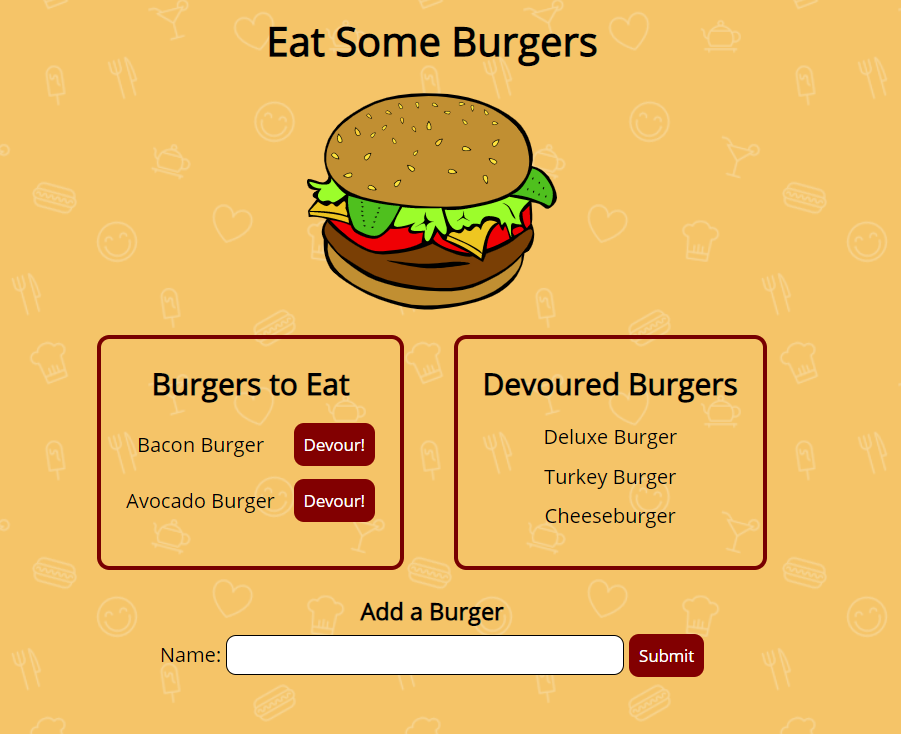

# Burger Logger

## Description

Burger Logger is a web application that allows users to add and devour burgers. After adding a burger, it waits under the "Burgers To Eat" section. When the user presses the Devour button, the burger is moved to the "Devoured Burgers" section. The form to add burgers is under both of the lists. The application uses the MVC design pattern and is built with Node, Express, Handlebars, MySQL and a homemade ORM.

## Table of Contents

- [Installation](#installation)
- [Usage](#usage)
- [Example](#example)
- [License](#license)
- [Contributing](#contributing)
- [Questions](#questions)

## Installation

To install the required dependencies, run `npm install`

This package assumes there is a MySQL server running on localhost:3306. If your server is running somewhere else, or your root password isn't "password", you can edit `config/connection.js` to reflect that.

Run the provided file `db/schema.sql` in MySQL Workbench to initialize the schema for this application. If you want to pre-populate the database with test values, run `db/seeds.sql` inside MySQL Workbench.

## Usage

To start the server, run `npm start`. To access the app after starting the server, go to http://localhost:3000 in your browser.

## Example

## License

This project is licensed under the MIT License - see the [LICENSE](LICENSE) file for details.

## Contributing

If you want to contribute, open a Pull Request and include a detailed description and screenshots of the changes.

## Questions

If you have any questions about the repo, open an issue or contact [ryan-harris](https://github.com/ryan-harris) directly at harris.ucla@gmail.com.
